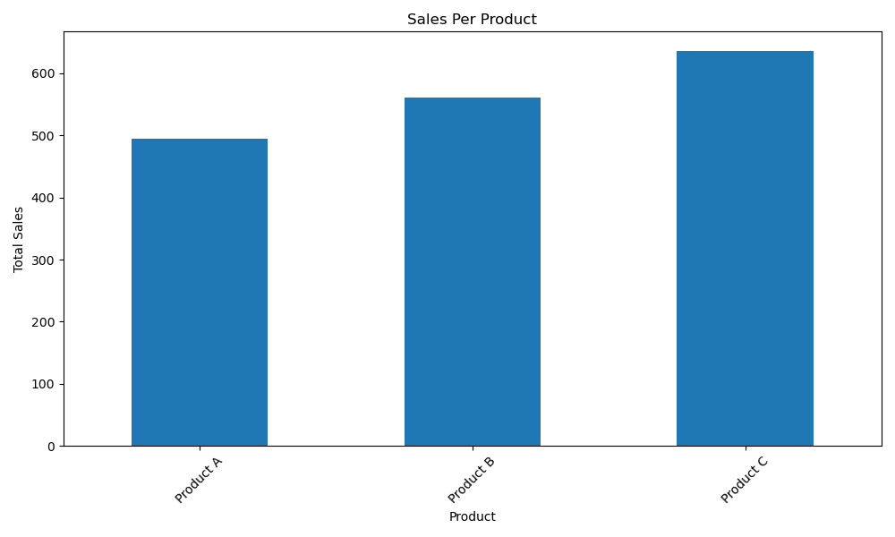
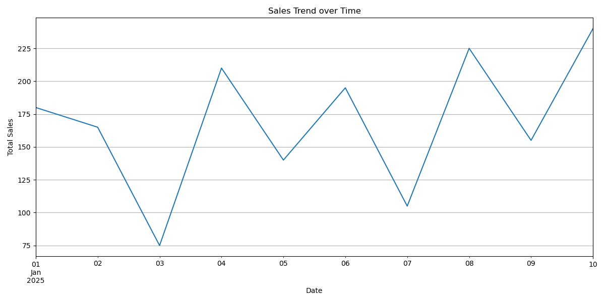

# Retail Sales Data Analysis
A comprehensive data engineering project analyzing retail sales data using Python, Pandas, and data visualization techniques.

#### Project Overview
 - This project demonstrates how to:

 - Extract data from retail sales CSV files

 - Transform and clean sales data

 - Analyze sales performance and trends

 - Generate visual reports and Excel exports

#### Tech Stack
  - Python

  - pandas - Data analysis

  - matplotlib - Data visualization

  - xlsxwriter - Excel reports

#### Process
#### 1️⃣ Extract
      Reads sales data from retail_sales.csv file

#### 2️⃣ Transform
       Cleans and processes the data:

       -  Handles missing values

       -  Converts data types

       -  Validates data quality

#### 3️⃣ Analyze
       Performs sales analysis:

       - Product performance ranking

       - Sales trend analysis

       - Daily sales metrics

#### 4️⃣ Report
       - Generates Excel reports and visual charts

       - Run the Pipeline
###### bash
##### Install dependencies
- pip install pandas matplotlib xlsxwriter openpyxl

###### Run the analysis
- python retail_sale_analyzer.py
##### Example Output
- Retail Sale Analyzer Starting...

 ##### Cleaned data: 
 - Removed 0 rows with missing values.

 ##### Total Sales per Product:
 - Product A    495
 - Product B    565
 - Product C    635

 ##### Best Selling Product: 
 - Product C

 ##### Average Daily Sales:
 - 56.5

 ##### Excel report generated successfully: 
 - sales_report.xlsx

 - Analysis complete!
 ##### Analysis Summary:
 - Total sales entries: 30

 ##### Product Performance:

 - Product A: 495
 
 - Product B: 565
 
 - Product C: 635
 ##### Best Seller:
 - Product C

 - Average Daily Sales: 56.5

##### Create retail_sales.csv with these columns:

- Date (YYYY-MM-DD)

- Product (text)

- Sales (numeric)
 
###### Example:

- csv
- Date,Product,Sales
- 2025-01-01,Product A,50
- 2025-01-01,Product B,60
- 2025-01-01,Product C,70
- 2025-01-02,Product A,45
- 2025-01-02,Product B,55
- 2025-01-02,Product C,65
- 2025-01-03,Product A,35
- 2025-01-03,Product B,25
- 2025-01-03,Product C,15
- 2025-01-04,Product A,60
- 2025-01-04,Product B,70
- 2025-01-04,Product C,80
- 2025-01-05,Product A,40
- 2025-01-05,Product B,45
- 2025-01-05,Product C,55
- 2025-01-06,Product A,55
- 2025-01-06,Product B,65
- 2025-01-06,Product C,75
- 2025-01-07,Product A,30
- 2025-01-07,Product B,35
- 2025-01-07,Product C,40
- 2025-01-08,Product A,65
- 2025-01-08,Product B,75
- 2025-01-08,Product C,85
- 2025-01-09,Product A,45
- 2025-01-09,Product B,50
- 2025-01-09,Product C,60
- 2025-01-10,Product A,70
- 2025-01-10,Product B,80
- 2025-01-10,Product C,90

# Retail Sales Data Analysis
A comprehensive data engineering project analyzing retail sales data using Python, Pandas, and data visualization techniques.

#### Chart View 

### Matthew Lawrence L
##### Bengaluru, Karnataka
##### lawrence82773824@gmail.com
